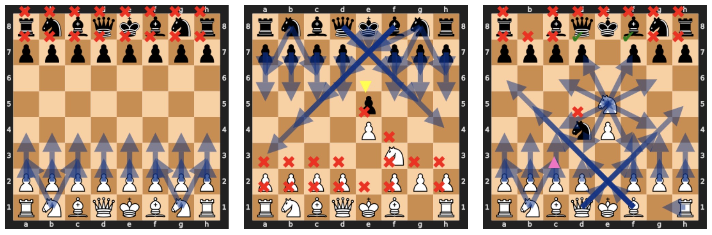
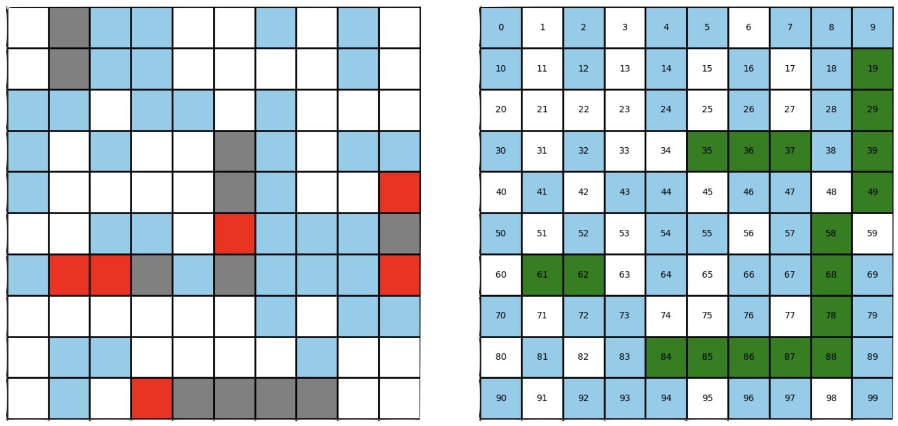

# fog of war

> "*All warfare is based on deception. Hence, when we are able to attack, we must seem unable; when using our forces, we must appear inactive; when we are near, we must make the enemy believe we are far away; when far away, we must make him believe we are near.*"
>     - **Sun Tzu**

## Environments

#### Dark Chess

A chess variant where each player can see only the squares which they occupy or can attack.

#### Battleship

The classic turn-based guessing game with partial observability.

#### Stratego

WIP
